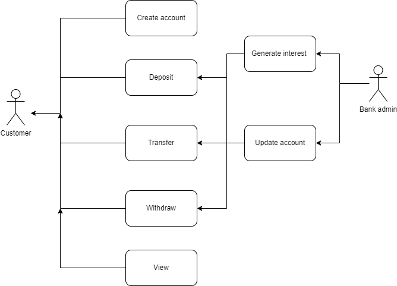

# Banking managment system
This is a simple banking system developed using Python and Tkinter for the graphical user interface. The system allows users to create accounts, deposit and withdraw funds, and transfer money between accounts. The system is developed following Agile methodology and XP engineering practices such as user stories, planning, simple design, pair programming, and testing.
Here is the use case diagram of the project.

## Features
- Create / Remove / Update account
- Deposit / Withdraw money
- Print account details
- Menu system

## Requirements
- Python 3.x
- Tkinter (should be pre-installed with Python)

## How to Run
- Clone the repository or download the source code as a ZIP file.
- Open a terminal or command prompt and navigate to the project directory.
- Run the main.py file using the command python main.py.
- The graphical user interface will run by using GUI.py, and you can start using the system.

